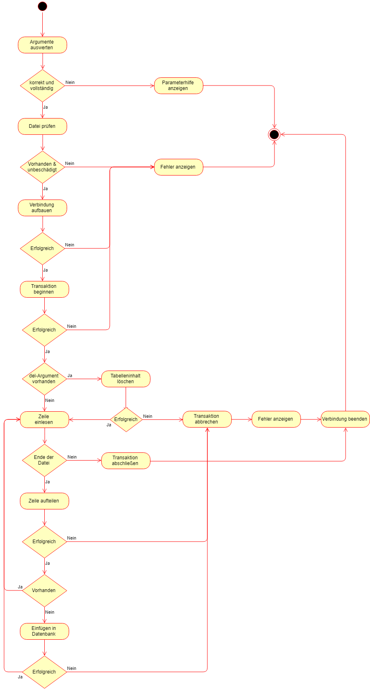

# HSNR-DBS-Praktikum-2-Version-a

## Vorbereitung

### Mehrere Sourcedateien

Hierzu legt man mehrer .cpp und .h Dateien (Source und Header) an und bindet die Header Datein mit dem Befehl #include "xyz.h" ein.

Nachfolgend läuft der Preprozessor, der Kompilier und der Linker.

### GCC

Kompilieren und linken mit gcc -> gcc source_1.c source_2.c source_3.c -o final

Libary: gcc -L path

### make und Makefiles

Aufrufen das Makefiles mit make im Terminal

Das Makefile baut den g++ Befehl auf

### Kommandozeile

Siehe read_args.cpp

### STL-String

const char *s = "Hello";

string str(s);

-----

string str = "Test";

char *s = (char *) "Hello";

string temp = string(s) + str;

const char *out = temp.c_str();

cout << out << endl;

-----

printf(str.c_str());

### Datei einlesen

Siehe Tokenizer, List und Main

### Flussidagramm

